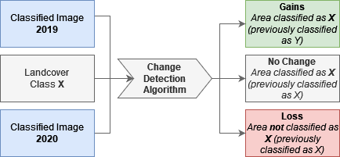

# Earth Engine Classification Pipeline

This repository contains the scripts that were used in the paper _"Using Google Earth Engine to track changes in land use after natural disaster in Cabo Delgado, Mozambique"_.

## Prequisits

If you want to use the code from this repository to run your own analysis, you have to fulfill the following prequisits:

- Google Earth Engine Account (sign up on https://earthengine.google.com/)
- Labelled Data to be used as training and validation data (for classification), or 2 classified images (for change detection)

### Clone this repository to your Google Earth Engine Account

There are two ways to clone this repository:

1. Copy & paste all file and their contents to the Google Earth Engine Code Editor (https://code.earthengine.google.com/)
2. Clone this repository using git and use Google Earth's git capabilities to copy it into your own account (https://earthengine.googlesource.com/)

We reccomend using git.

**Attention:** Either way, when you use these scripts you have to change the imports in the files (e.g., require("our_path") to require("your_path")). Otherwise adjustments might not work!

## Usage

The code has two general usages:

1. Create a composite image and classify it based on training data
2. Run a change detection analysis to see how the classification changes between two classified images (quantitative and visually)

## Composite Creation and Classification

The entry point to execute the composite creation and classification script is the file `main`.

### A word about the CONFIG

In the file `main.js` you will find a variable named `CONFIG`.
In this config you will find all the parameters that you can adjust to run your analysis.
The following table will give you a description of all the configurations and possible adjustments.

| Parameter                          | Type             | Description                                                                                                                             |
| ---------------------------------- | ---------------- | --------------------------------------------------------------------------------------------------------------------------------------- |
| YEAR                               | Integer          | The year for which the collection is loaded                                                                                             |
| REGION_NAME                        | String           | The name of the region (used in the naming of the layers and in exports)                                                                |
| REGION_LIST                        | ee.List([""])    | List of the codes of the regions of interests according to the shape files (e.g., ee.List(["MZ0104"]))                                  |
| REGION_LIST_COLUMN                 | String           | The column in which we search for the codes of the REGION_LIST (e.g., "ADM2_PCODE")                                                     |
| REGION_SCALE                       | Integer          | The zoom factor for visuals in Google Earth Engine (e.g., 9)                                                                            |
| MAX_CLOUD_COVERAGE                 | Integer          | Percantage of maximal cloud coverage of an image to be considered for further analysis (e.g., 30)                                       |
| REGION                             | null             | Is automatically set based on REGION_NAME                                                                                               |
| COLLECTION                         | String           | The collection used for the analysis (either "LANDSAT" or SENTINEL")                                                                    |
| COLLECTION_SCALE                   | null             | Automatically set based on the chosen COLLECTION                                                                                        |
| IS_SENTINEL                        | null             | Automatically set based on the chosen COLLECTION                                                                                        |
| EXPORT_TRUE_COLOR                  | Boolean          | If activaed, the resulting true-color image can be exported to e GeoTIFF file in Google Drive                                           |
| RUN_PEARSON_CORRELATION            | Boolean          | If activated, a pearson correlation analysis is run on the bands of the collection                                                      |
| PEARSON_CORRELEATION_BANDS         | null             | Loaded based on the COLLECTION. Bands to be tested can be adjusted in bandSettings.js                                                   |
| MAKE_CLASSIFICATION                | Boolean          | If activated, the resulting composite image is classified based on the provided training data                                           |
| CLASSIFIERTYPE                     | String           | Only Random Forest supported at the moment (e.g., "RF")                                                                                 |
| RANDOM_FOREST_TREES                | Integer          | Number of trees to use for the random forest (e.g., 500)                                                                                |
| FEATURE_COLLECTION_SPLIT           | Float            | Percentage (float from 0 to 1) of how much of the data should be training and how much should be validation                             |
| CLASSIFICATION_LABEL               | String           | The label used for each class in the feature collection. Can be anything you wish dataset                                               |
| FEATURE_COLLECTION_LIMIT           | Integer          | Limit number of polygons per collection to this number (rarely used, should be high enough e.g., 5000)                                  |
| EXPORT_INDIVIDUAL_CONFUSION_MATRIX | Boolean          | If activated, exports a confusion matrix for each seed run (20 seeds -> 20 exported files)                                              |
| EXPORT_CONFUSION_MATRICES          | Boolean          | If activated, exports one confusion matrix for all seed runs (20 seeds -> 1 file containing 20 confusion matrices)                      |
| MAP_CLASSIFIED_IMAGE               | Boolean          | If activated, adds the classified image(s) as a new layer to the Earth Engine                                                           |
| EXPORT_CLASSIFIED_IMAGE            | Boolean          | If activated, the classified image(s) can be exported as a GeoTIFF file                                                                 |
| VEGETATION_INDEX_COMBINATION       | String           | The combination of indeces used to create the composite image (e.g., "NOINDECES" or "INDEX1"). Adjustable in `bandSettings.js`          |
| VEGETATION_INDECES                 | null             | Automatically set based on VEGETATION_INDEX_COMBINATION                                                                                 |
| GLCM_WINDOW_SIZE                   | Integer          | GLCM / Texture window size, e.g, 5                                                                                                      |
| GLCM_COMBINATION                   | String           | The combination of texture features to used to create the composite image (e.g., "NOTEXTURE", or "T1"). Adjustable in `bandSettings.js` |
| GLCM_BANDS_FILTER                  | null             | Automatically set based on GLCM_COMBINATION                                                                                             |
| GLCM_RELEVANT_BANDS                | null             | Automatically set based on COLLECTION and the lists in `bandSettings.js`                                                                |
| BANDS_TO_BE_REMOVED                | null             | Automatically set based on COLLECTION and the lists in `bandSettings.js`                                                                |
| DRAW_TRAINING_SAMPLES              | Boolean          | If activated, shows the training polygons on the map                                                                                    |
| SHOW_ACCUARCY                      | Boolean          | If activated, prints the accuracy of the classification to the console                                                                  |
| SHOW_REBSTITUTION_MATRIX           | Boolean          | If activated, prints the rebstitution matrix to the console.                                                                            |
| EXPLAIN_CLASSIFIER                 | Boolean          | If activated, prints an explanation of the classifier to the console.                                                                   |
| CREATE_BAR_CHART                   | Boolean          | If activated creates a bar chart.                                                                                                       |
| BAR_CHART_TYPE                     | String           | Either "CONSOLE" or "EXPORT" to print or export the bar chart                                                                           |
| SHOW_CLASS_INDIVIDUALLY            | Boolean          | if activated, adds each class as an individual layer to the map ( of the classified image)                                              |
| DEACTIVATE_MAP_DRAWING             | Boolean          | Show or hide results on map (e.g. classification etc.) [note: this only hides all the layers. Users can still activate them later]      |
| SHOW_LEGENDS                       | Boolean          | If activated, show legends on the Map for classes and settings                                                                          |
| SHOW_NUMBER_OF_POLYGONS            | Boolean          | If activated, prints the number of polygons and pixels to the console                                                                   |
| SHOW_COMPOSITE_IMAGE               | Boolean          | If activated, prints the composite image to the console.                                                                                |
| SHOW_DATASET_SIZE                  | Boolean          | If activated, prints the training, validation data set sizes to the console                                                             |
| EXPORT_DATA_POLYGONS               | Boolean          | If activated, exports the training and validation polygons as a GeoTIFF                                                                 |
| PRINT_NUMBER_OF_IMAGES             | Boolean          | If activated prints the number of images that are in the composite                                                                      |
| SPLIT_SEED                         | Integer          | A seed used to split the data into training & validation data (reproducibility)                                                         |
| RF_SEEDS                           | List of integers | To reproduce the same results you can define a list of seeds that are used to build the random forests (e.g., [5,4,3])                  |
| RF_SEED                            | Integer          | Automatically set based on the RF_SEEDS list                                                                                            |

### Band settings [GLCM and Spectural Indeces]

In the file `bandSettings.js` you can adjust the settings regarding the bands that are used in the analysis.

| Variable                     | Description                                                                                                                                                             |
| ---------------------------- | ----------------------------------------------------------------------------------------------------------------------------------------------------------------------- |
| GLCM_BAND_COMBINATION        | A list of GLCM metrics to be used when creating the composite image. You can define your own combinations and use them in the `CONFIG` under `GLCM_COMBINATION`.        |
| VEGETATION_INDEX_COMBINATION | A list of indeces that should be calculated and added to the image composite (EVI; NDVI, NDWI, SAVI, NDBI, UI are available)                                            |
| COLLECTION_SCALE             | Define the scale that is used based on the collection (Landsat/Sentinel)                                                                                                |
| PEARSON_CORRELEATION_BANDS   | Define the bands to be used for running the pearson correlation based on the collection (Landsat/Sentinel)                                                              |
| GLCM_RELEVANT_BANDS          | Define the bands to be used as input bands for computing the texture metrics (for each input band, the combination defined in GLCM_BAND_COMBINATION will be calculated) |
| BANDS_TO_BE_REMOVED          | Define the bands that will be removed from the composite image (before running the classification)                                                                      |

See https://developers.google.com/earth-engine/apidocs/ee-image-glcmtexture for more information about the texture metrics.

### Data Preparation

To run your own classification, you will need to have some labelled training data. That can either be created directly in Google Earth Engine using their polygon tool or in Google Earth Plus and then exported and reimported into Google Earth Engine.

In the file `data.js` you can import your feature collection and define a object in the following:

    var data2022 = {
        waterbodies: WaterbodiesFeatureCollection,
        urban: UrbanFeatureCollection,
        vegetation: VegetationFeatureCollection,
        grassland: GrasslandFeatureCollection,
        bareSoils: BareSouldsFeatureCollection,
        agriculture: AgricultureFeatureCollection,
    };

And then you can add this to the collection:

    var rawTrainingData = {
        2022: data2022,
    };

### Region of interest

For the selection of the region we use the shape files from https://data.humdata.org/dataset/cod-ab-moz.
But you could youse your own shapefiles and definition as well.

How to adjust the region:

1. Import your desired shape file to `region.js`
2. rename it as adminlevel2 (or adjust the code to your desired naming convention)
3. Adjust `CONFIG` parameters like REGION_LIST_COLUMN and REGION_LIST based on your shape file structure

### Classification

The following classes were defined:

- 0 Water Bodies (WB): areas periodically or permanently covered by water
- 1 urban: roads, towns, cities.. (this can be any type of building or road or manmade structure)
- 2 Vegetation: natural vegetation/forest
- 3 Grassland (GR): primarily covered by grass with or without scattered shrubs
- 4 Bare soils (BS): uncovered areas which in the study area include prepared areas for agriculture
- 5 Agriculture: cultivated fields

In this version of the script the classes are hardcoded, as in you would need to change some code to adjust the classes we used in our paper. But it can be done.

Here are some pointers:

- In `params.js` we defined the classNames and the palette for the colors when visualizing the image
- In `data.js` we defined the classes as part of the imported feature Collections and make some transformations with them

## Change Detection

You can run the change detection in the file `detectChanges.js`.

This is how it works:

1. Import 2 classified images to Google Earth Engine and import them into the `detectChanges.js` file
2. Define them as earlierComposite (e.g., 2019) and laterComposite (e.g., 2020)
3. Adjust the `CHANGECONFIG` according to your need (similar parameters as the `CONFIG`), e.g. adjust which colors are for gain and losses
4. Run the file!

The following shows a overview of the scripts:

**Console Logs** shows for each individual class the area in km^2 that was gained, lossed and remained the same (same class).

**GeoTIFF file** exports for each class where a pixel is classified in the following:

- -1: Loss of this class to another class from earlierComposite to laterComposite
- 0: NoChange, the class was the same in earlierComposite and laterComposite
- 1: Gain, the class gained new pixels from earlierComposite to laterComposite

Alternatively, the maps are also shown in the Earth Engine directly and can be hidden/shown via the layers.

_Tip_: only ever show one layer to see the gains and losses of one individual class!

## Troubleshooting

Depending on the size of your dataset, region, and your configurations, the analysis might run out of time.
Here are some tipps to avoid that problem:

- Run smaller independent analysis (e.g., first run the pearson correlation, then adjust the paramters and run the classification)
- Export the analysis result to Google Drive. This extends the allowed runtime of the analysis granted by Google Earth Engine.
- When an export runs out of time, immediately restart it - Google Earth Engine sometimes caches the previous result (even if it failed) and might allow you to continue at the previous point.
- Some configurations are not possible or will time out based on the restrictions from Google Earth Engine.
